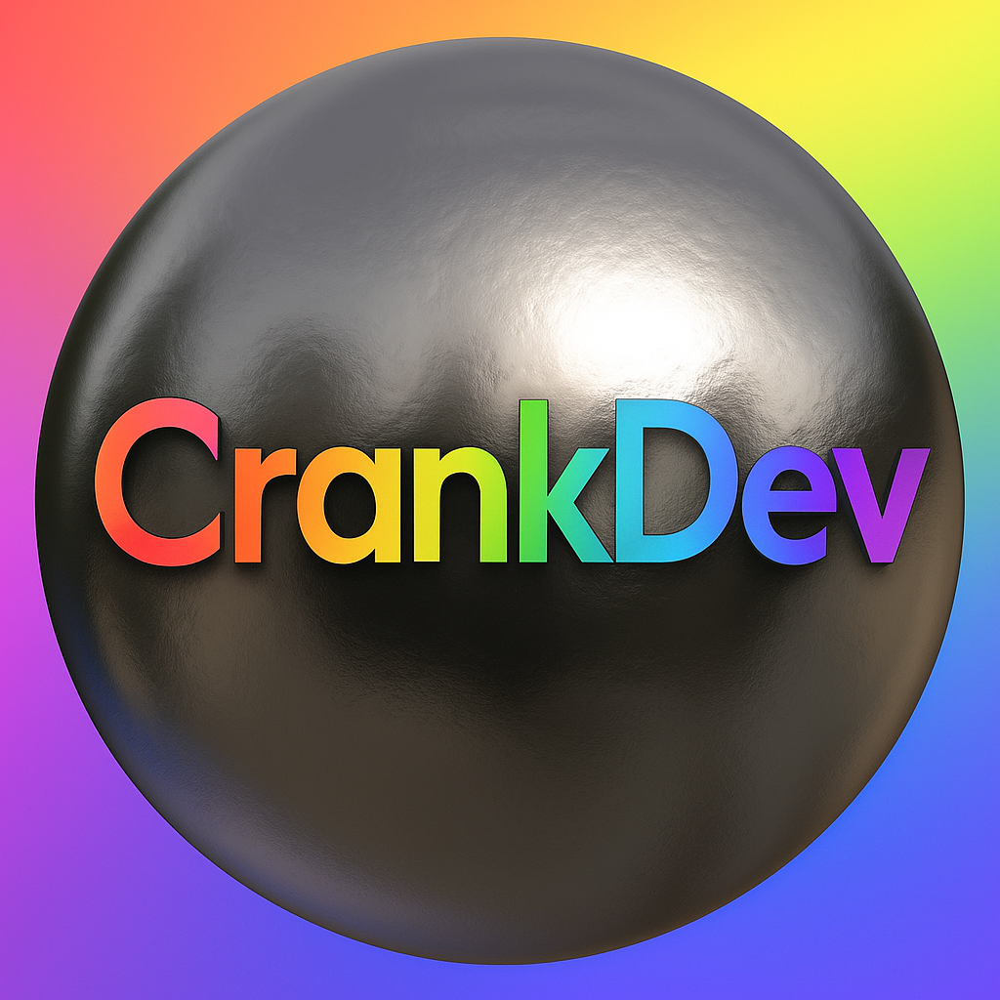

# Quizzling

  

  **An interactive quiz platform built for learning and fun 🎯**

  
  
  
  
  

## 📖 About

**Quizzling** is a modern quiz application designed to make learning more engaging.
It allows users to **play quizzes, test their knowledge, track results, and even create their own quizzes**.
Perfect for classrooms, self-study, or just having fun with friends!

## ✨ Features

* 🎲 **Play Quizzes**: Answer multiple-choice, true/false, and custom questions
* 📝 **Create Quizzes**: Build your own quizzes with a simple interface
* 📊 **Score Tracking**: View your performance instantly with feedback
* 🏆 **History**: Save and review your past quiz attempts
* 🎨 **Modern UI**: Built with TailwindCSS for a clean, responsive design
* ⚡ **Fast & Scalable**: Powered by Node.js, Express and MySQL backend

## 🛠️ Technologies Used

| Technology | Purpose |
|------------|---------|
| **TypeScript** | Safer and scalable development |
| **React** | Dynamic and interactive frontend |
| **TailwindCSS** | Clean, modern, responsive UI |
| **Node.js + Express** | Backend REST API |
| **MySQL** | Persistent data storage (quizzes, questions, results) |

## 🚀 How It Works

1. **Choose a Quiz**: Browse from available quizzes.
2. **Answer Questions**: Each question can be multiple-choice, true/false, or custom.
3. **Submit Answers**: Instantly see your score with correct/incorrect highlights.
4. **Track Results**: Check your quiz history and progress over time.
5. **Create Your Own**: Add quizzes to share knowledge with others.

## 💻 Getting Started

### Prerequisites
- Modern web browser. Really, that's all you need.

## Made by Crank-DEV, aka @bnzin_xm <3